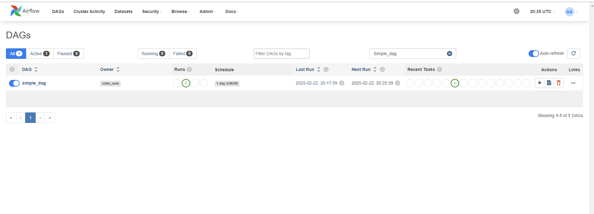
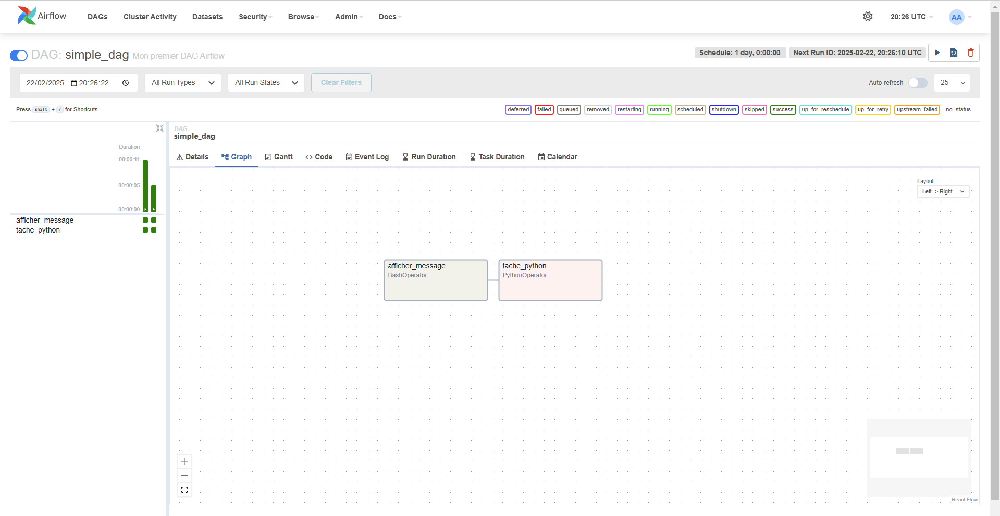
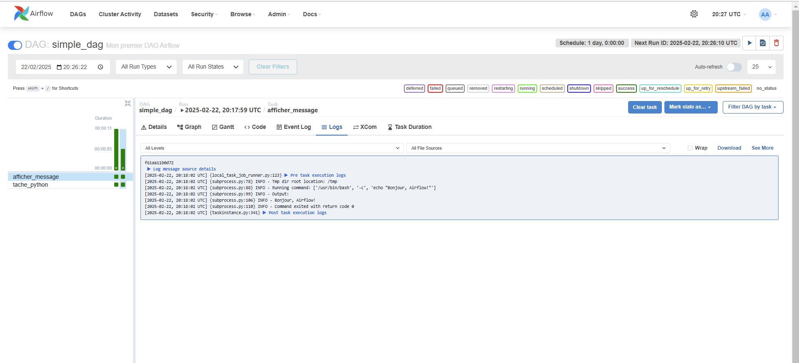

# 🚀 Étape 2 : Création d'un DAG Simple

## 🎯 Objectif
Créer un DAG qui permet d'explorer l'environnement d'Airflow et de comprendre les concepts de base.

## 📚 Ressources
- [Documentation officielle d'Airflow](https://airflow.apache.org/docs/apache-airflow/stable/tutorial/fundamentals.html)

---

## 📝 Exercices Pratiques

### Exercice 1 : Configuration initiale

#### Description
Nous allons créer notre premier DAG Airflow avec une configuration de base.


```python { .py .copy }
from datetime import datetime, timedelta
from airflow.models.dag import DAG
from airflow.operators.bash import BashOperator

default_args = {
    # À compléter
}

dag = DAG(
    # À compléter
)

tache_afficher_message = BashOperator(
    # À compléter
)
```

#### Tâches à réaliser
1. Créer un nouveau fichier `simple_dag.py` dans le dossier `dags`.
2. Définir les arguments suivants dans `default_args`:
   
      - `owner`: votre nom
     
      - `retries`: 2
     
      - `retry_delay`: 10 minutes
     
      - `start_date`: date actuelle
  
3. Créer une instance de DAG avec:
   
      - ID: `'simple_dag'`
     
      - Arguments par défaut configurés `default_args=default_args`
     
      - Description personnalisée `description='.....'`
     
      - Intervalle d'exécution: 1 jour `schedule_interval=timedelta(days=1)`
  
4. Ajouter une tâche `BashOperator` qui affiche "Bonjour, Airflow!" nommer  `afficher_message`.
      - [BashOperator Docs](https://airflow.apache.org/docs/apache-airflow/stable/howto/operator/bash.html)

#### 💡 Astuces

   - Le fichier doit être placé dans le dossier `dags`.
   - Utilisez `catchup=False` pour éviter l'exécution des DAGs historiques.
   - Testez votre DAG avec `airflow dags test [dag_id] [date]`.

#### Solution

??? example "Afficher la solution"
    ```python { .py .copy }
    from datetime import datetime, timedelta
    from airflow.models.dag import DAG
    from airflow.operators.bash import BashOperator

    default_args = {
        'owner': 'votre_nom',
        'retries': 2,
        'retry_delay': timedelta(minutes=10),
        'start_date': datetime.now(),
    }

    dag = DAG(
        'simple_dag',
        default_args=default_args,
        description='Mon premier DAG Airflow',
        schedule_interval=timedelta(days=1),
        catchup=False
    )

    tache_afficher_message = BashOperator(
        task_id='afficher_message',
        bash_command='echo "Bonjour, Airflow!"',
        dag=dag
    )
    ```

---

### Exercice 2 : Intégration Python

#### Description
Ajoutez des tâches Python à votre DAG pour étendre ses fonctionnalités.


```python { .py .copy }
from airflow.operators.python import PythonOperator
import logging

def generer_message():
   logging.info("Exécution de la tâche Python")
   return "Tâche exécutée avec succès"

tache_python = PythonOperator(
   # À compléter
)

# Définition des dépendances
# À compléter
```

#### Tâches à réaliser

1. Ajouter le code ci-dessus dans `simple_dag.py`
2. Créer la fonction Python `generer_message()` qui utilise le logger pour afficher un message
3. Ajouter une nouvelle tâche `tache_python` utilisant `PythonOperator` avec la fonction `generer_message()`
4. Définir les dépendances pour que `tache_python` s'exécute après `tache_afficher_message`

#### 💡 Astuces

Pour définir l'ordre d'exécution des tâches, utilisez les opérateurs de dépendance:

   - Syntaxe: `tache_1 >> tache_2` (tache_2 s'exécute après tache_1) ou
   - Syntaxe: `tache_2 >> tache_1` 

  
#### Solution

??? example "Afficher la solution" 
    ```python { .py .copy }
    import logging
    from datetime import datetime, timedelta
    from airflow.models.dag import DAG
    from airflow.operators.bash import BashOperator
    from airflow.operators.python import PythonOperator


    default_args = {
        'owner': 'votre_nom',
        'retries': 2,
        'retry_delay': timedelta(minutes=10),
        'start_date': datetime.now(),
    }

    dag = DAG(
        'simple_dag',
        default_args=default_args,
        description='Mon premier DAG Airflow',
        schedule_interval=timedelta(days=1),
        catchup=False
    )

    tache_afficher_message = BashOperator(
        task_id='afficher_message',
        bash_command='echo "Bonjour, Airflow!"',
        dag=dag
    )


    def generer_message():
        logging.info("Exécution de la tâche Python")
        return "Tâche exécutée avec succès"

    tache_python = PythonOperator(
        task_id='tache_python',
        python_callable=generer_message,
        dag=dag
    )

    # Définition des dépendances
    tache_afficher_message >> tache_python
    ```

---

## 🔍 Vérification

Pour valider votre DAG :

1. Vérifiez sa présence dans l'interface web d'Airflow.
    - [http://localhost:8080/](http://localhost:8080/)

2. Connectez-vous avec vos identifiants :
    - Utilisateur : `airflow`
    - Mot de passe : `airflow`

3. Recherchez votre DAG :
    - Dans la liste des DAGs disponibles, trouvez `simple_dag`
    - 

4. Déclenchement et surveillance :
    - Déclenchez manuellement le DAG via l'interface

5. Visualisez le graphe :
    - Accédez à l'onglet "Graph View"
    - Vous devriez voir la représentation visuelle de votre DAG
    - 

6. Analysez les logs :
    - Double-cliquez sur chaque tâche pour accéder aux logs
    - Vérifiez le bon déroulement des exécutions
    - 

---
    


